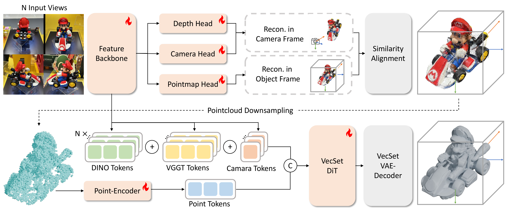

# UniRecGen: Unifying Multi-View 3D Reconstruction and Generation

> **UniRecGen: Unifying Multi-View 3D Reconstruction and Generation**
>
> 

  

Sparse-view 3D modeling represents a fundamental tension between reconstruction fidelity and generative plausibility. Feed-forward reconstruction excels in efficiency and input alignment but often lacks the global priors needed for structural completeness, while diffusion-based generation provides rich geometric details but struggles with multi-view consistency. **UniRecGen** is a unified framework that integrates these two paradigms into a single cooperative system. We align both models within a shared canonical space and employ disentangled cooperative learning, enabling seamless collaboration during inference. The reconstruction module provides canonical geometric anchors, while the diffusion generator leverages latent-augmented conditioning to refine and complete the geometric structure.

## Demo

https://github.com/user-attachments/assets/1bf54a29-67c0-4d8f-8b69-ba7cdfe63cf3

## Highlights

- **Unified Framework** — Integrates feed-forward multi-view 3D reconstruction and diffusion-based 3D generation into a single cooperative system for high-fidelity shape modeling from unposed sparse views.
- **Branch Repurposing** — Canonicalizes the reconstruction model's predictions into an object-centric space by repurposing only the pointmap head, preserving pretrained 3D priors while enabling generation-compatible outputs.
- **Latent-Augmented Multi-View Conditioning** — Enriches dense DINO image tokens with VGGT geometric latents and camera embeddings, allowing the diffusion model to leverage multi-view context while retaining strong appearance priors.
- **State-of-the-Art Performance** — Consistently outperforms existing methods (TRELLIS, Hunyuan3D-MV, LucidFusion, SAM 3D, ReconViaGen) across all geometric metrics on Toys4K and GSO benchmarks.

## Method Overview

UniRecGen operates as a two-stage modular pipeline:

**Stage 1: Generation-Compatible Feed-Forward Reconstruction**

Given N unposed input views, a shared feature backbone (VGGT) extracts features and feeds them into three prediction heads — Depth, Camera, and Pointmap. Through our *branch repurposing* strategy, the pointmap head is adapted to predict in canonical object space while keeping depth and camera heads in the reference frame, preserving pretrained geometric priors. A *similarity alignment* step then transforms the more accurate depth-derived 3D points into canonical space, producing a high-quality canonical point cloud.

**Stage 2: Reconstruction-Guided Controllable Generation**

The canonical point cloud is downsampled and used as explicit geometric conditioning for a VecSet Diffusion Transformer (built on Hunyuan3D-Omni). Multi-view DINO tokens are augmented with VGGT geometric latents and camera embeddings via *latent-augmented view conditioning*, enabling the diffusion model to jointly leverage dense visual semantics and precise multi-view geometric context. The VecSet VAE-Decoder then produces a high-fidelity triangular mesh.

## Code

**Code will be released soon. Stay tuned!**

Star this repo to get notified when the code is available.

## Acknowledgements

This project builds upon several excellent open-source works including [VGGT](https://github.com/facebookresearch/vggt) and [Hunyuan3D-Omni](https://github.com/Tencent-Hunyuan/Hunyuan3D-Omni). We thank the authors for their contributions to the community.
